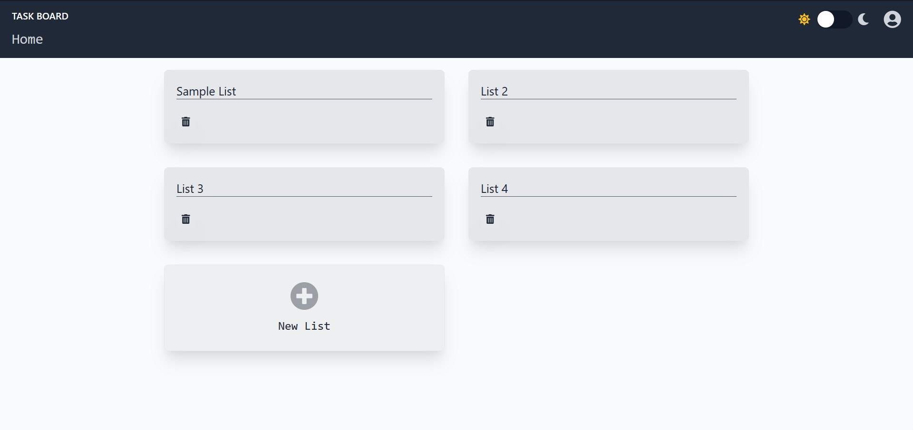
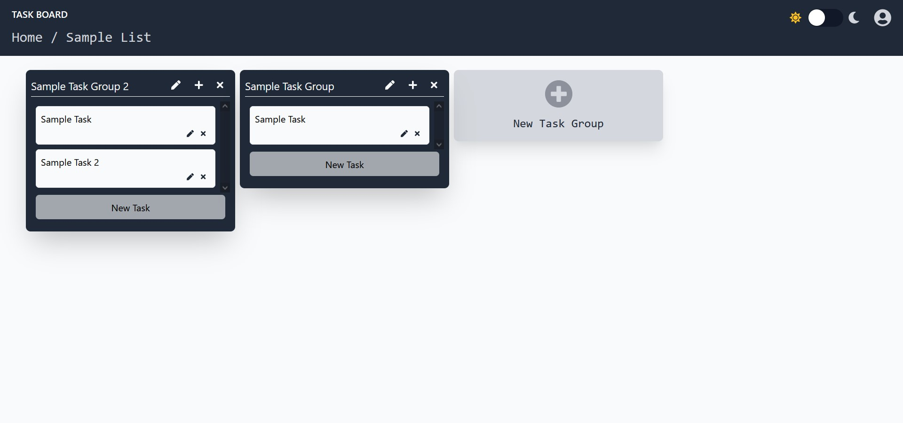
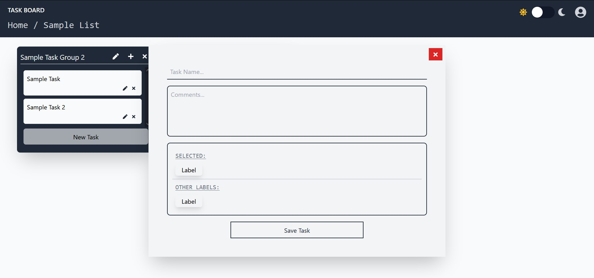

# TaskBoard
Productivity Manager built using the MERN *(MongoDB, Express.js, React.js and Node.js)*  Stack with GraphQL. Tasks can be noted and maintained throughout the lifetime of the Project. 
<br/><br/>
*The project is personal project that is still under development.*

### Database Schema
```
List: {
    id: ObjectID // Auto-Generated
    title: String // Title of List
    tasks: [ID, ...] // References to Task
}
```
```
TaskGroup: {
    id: ObjectID // Auto-Generated
    title: String // Title of Task Group
    tasks: [
        Task: {
            id: ObjectID // Auto-Generated
            title: String // Title of Task
            description: String // Description/ Comments about a Task
            labels: [ID, ...] // Reference to Label
        },
        ...
    ] // Embedded Tasks
}
```
```
Label: {
    id: ObjectID, // Auto-Generated
    title: String // Title of the Label
    color: String // Color of the Label in HexCode
}
```

### Screenshots

<a href="./screenshots/TaskBoard_ListMenu.jpg"></a>
<a href="./screenshots/TaskBoard_TaskGroup.jpg"></a>
<a href="./screenshots/TaskBoard_NewTask.jpg"></a>
